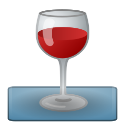

<h1 align="center">
  </img>
  <br />
  Win32-AppImage | <a href="https://github.com/sudo-give-me-coffee/wine-appimage/releases/tag/continuous">Downloads</a>
</h1>

<p align="center"><i>"A simple, lightweight way to distribute the 32-bit Microsoft Windows® application on Linux"</i>.<br> It works on Ubuntu, Fedora, Debian, their derivates and all other major Linux
distributions.</p>

<hr>

# Basic usage

The basic usage is relative simple and use only 8 steps is basically composed bt 2 groups of steps:

#### First group: Create the bottle

1. Download Wine AppImage by clicking on "**Downloads**" link above and selecting desired version
2. Open a terminal where you has Win32 AppImage
3. Turn it executable:
```bash 
chmod +x Wine-*-x86_64.AppImage
```
4. Create an bottle:
```bash 
./Wine-*-x86_64.AppImage create-bottle "My Bottle"
```

5. Modify with winetricks (if needed):
```bash 
./Wine-*-x86_64.AppImage winetricks "My Bottle"
```

6. Install your application:
```bash 
./Wine-*-x86_64.AppImage install "My Bottle" "/path/to/my/application-setup.exe"
```

#### Second group: Package as AppImage::

7. First, test your application:

```bash 
./Wine-*-x86_64.AppImage run "My Bottle" "C:/Where/Application/was/installed/application.exe"
```
8. Remove unnecessary resources:

```bash 
./Wine-*-x86_64.AppImage --strip "My Bottle" mono gecko
```

9.  Let's package it:
```bash 
./Wine-*-x86_64.AppImage package "My Bottle"              \
    "C:/Where/Application/was/installed/application.exe"  \
    Utility
    "data/icon.png"
```

# A more detalhed usage:
The **wine32-appimage** Commands

> Note: All commands must receive a bottle name


| Command         |    | What its does                                   |
|-----------------|----|-------------------------------------------------|
| create-bottle   | => | Create a new bottle with default settings       |
| install         | => | Install a software from outside bottle          |
| run             | => | Run a software already on the bottle            |
| --strip         | => | Remove unnecessary resources                    |
| package         | => | Package the bottle as AppImage                  |

Usage per command:

* create-bottle:
```
create-bottle  "Bottle Name"
```
The "Bottle Name" is also "App Name"

* install:
```
install  "Bottle Name" "path/to/file.exe"
```
The "path/to/file.exe" is relative to current directory, and no need to be inside om "bottle"

* --strip:
```
--strip  "Bottle Name" resource
```
"resource" can be any of these things:

```
 
  mesa3D   -->  Support for DirectX 8 apps
  windows  -->  Wine hardcoded libs (not recommended in most cases)
  gecko    -->  Trident open source replacement (needed by applications that displays HTML content)
  mono     -->  Open source replacement for .NET Framework (with Windows Forms)
  
```

* run:
```
run  "Bottle Name" "C:\path\to\file.exe"
```
The "C:/path/to/file.exe" must be absolute you don't need worry about slashes be "\\" or "/" but make sure that starts with "C:" and file exists on "Bottle Name/prefix/drive_c/"

* package:
```
package  "Bottle Name" "C:\path\to\file.exe" "Category" "path/to/icon.png"
```
The "C:/path/to/file.exe" is the main executable of your program and must be absolute you don't need worry about slashes be "\" or "/" but make sure that starts with "C:" and file exists on "Bottle Name/prefix/drive_c/"

"Category" represents basically what your application does, the valid words is:

```
 
    AudioVideo     Audio        Video    Development    Education    Game
    Graphics       Network      Office   Science        Settings     System
    Utility
 
```
At last "path/to/icon.png" is the icon of your program, the path is relative to current directory, and no need to be inside om "bottle", but mustbe in PNG format with a recommended 256x256px resolution

<hr>

The **WineLauncher** Commands

| Command         |    | What its does                                   |
|-----------------|----|-------------------------------------------------|
| -copy-app-files | => | Defines if app files will extracted of AppImage |

They receives only "yes" or "no" as value for example:

* To activate -copy-app-files use:
```
    -copy-app-files yes
```

* To deactivate -copy-app-files use:
```
    -copy-app-files yes
```

<hr>

At last, the commands for Wine tools bundled with **wine32-appimage**:


| Command         |    | What its does                                   |
|-----------------|----|-------------------------------------------------|
| --winetricks    | => | Open Winetricks                                 |
| --winecfg       | => | Open Wine configurator                          |
| --regedit       | => | Open Wine register editor                       |
| --taskmgr       | => | Open a task manager for wine apps               |
| --uninstaller   | => | Open the 'Wine Uninstaller'                     |

* [winetricks](https://wiki.winehq.org/Winetricks)
* [winecfg](https://wiki.winehq.org/Winecfg)
* [regedit](https://wiki.winehq.org/Regedit)
* [taskmgr](https://wiki.winehq.org/Taskmgr)
* [uninstaller](https://wiki.winehq.org/Uninstaller)

# Credits:
* [win32-appimage](LICENSE.md)
* [Hook and preloader](https://github.com/Hackerl)
* [Wine](https://www.winehq.org/)
* [Visual Style](https://www.deviantart.com/lassekongo83/art/Kupo-Finale-for-XP-107950198)

